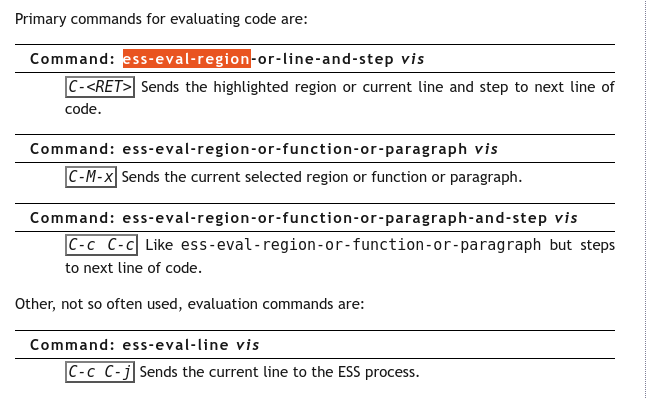
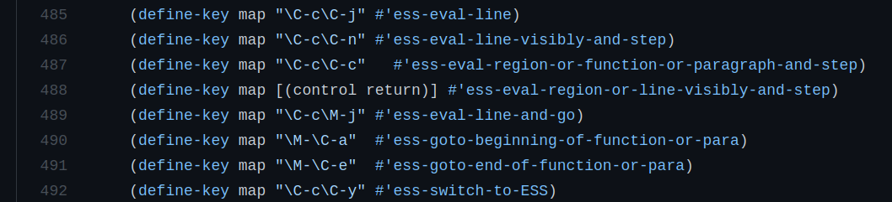
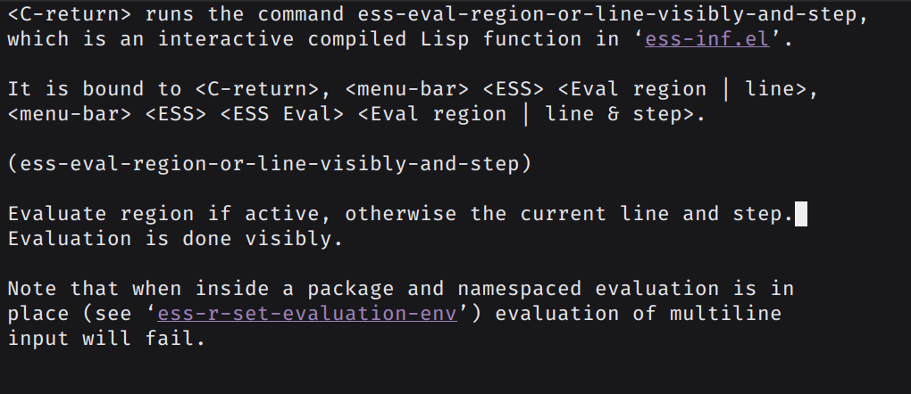
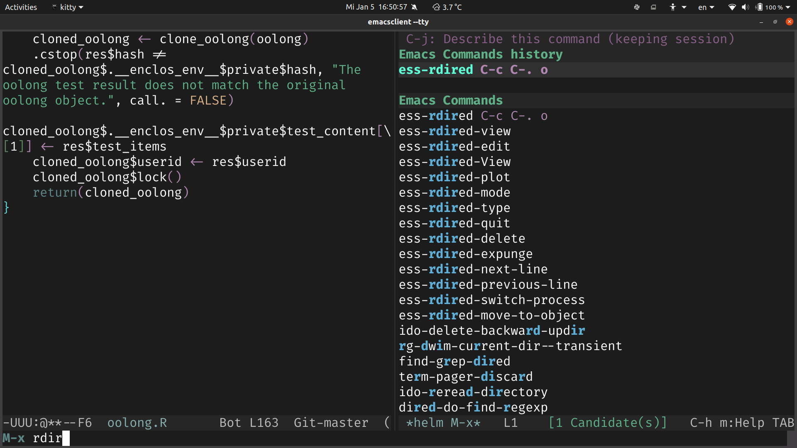

Emacs and ESS: How to type more by typing less - Part 1
================
Chung-hong Chan

# Introduction

This is a 2-part tutorial on how to type more by typing less. The
overarching objective is to customize the keyboard interaction in your R
programming sessions on emacs.

But throughout the process, we can also understanding the mechanic of
emacs. In Part 1, we are going to explore emacs and learn the basic of
binding key. In Part 2, I am going to tell you some “hacks” I find
useful for editing R code.

# Part 1: Exploring emacs

For Part 1, please consider the process is more like a guided text
adventure game. We are exploring an environment that seems to be
familiar. You might not understand 100% but that is normal. The spirit
of this part is to gain experience through exploring. In my opinion,
modifying a key combination is the ideal entry point to learn the
interworking of emacs to make emacs really your own. I quote the
following from the [emacs
tutorial](https://github.com/emacs-mirror/emacs/blob/b4e709c41f90c644952fe7e9a8b932c6367e495a/etc/tutorials/TUTORIAL#L1121-L1122):

> This tutorial is meant to be understandable to all new users, so if
> you found something unclear, don’t sit and blame yourself - complain\!

Yes, please send your complaints to me.

## Empowerment promises

I am going to guide you through an exploration of emacs to study how
emacs works. In the process, you will learn:

1.  The interworking of emacs
2.  how to (actually) get help
3.  how to customize emacs to your liking

## What’s going on under the hood after you press a key combination?

Suppose you have written a line of R code in a buffer and you want to
evaluate it. You watched the [tutorial by Tyler
Smith](https://youtu.be/So1LYzSk9o0?t=426) and you know the key
combination is “Ctrl Enter”. Or, in the convention of emacs,
`<C-return>` \[1\]. For whatever reason \[2\], you find this key
combination not convenience and you want to change it.

In order to change it, you need to understand how key combinations are
handled by emacs. This exploration can give you a sense of how emacs
works.

Suppose you have just pressed the key combination `<C-return>` to
evaluate a line of R code. You can then press this key combination: `C-h
l`. It should open up a buffer with a list. You should see something
like this in the last few lines:

``` 
 <C-return>     ;; ess-eval-region-or-line-visibly-and-step
 C-h l          ;; view-lossage
```

`C-h l` displays the recent keys you have pressed. That’s why you see
`C-h l` there. And then, each row contains two columns. Column one is
the key combination you’ve pressed and column two is the corresponding
**emacs function**. Actually, emacs behaves more or less like your R
session: you tell emacs to execute some functions, and then emacs
executes those functions and if applicable, gives you responses.
Important message here is that a key combination, e.g. <C-h l>, is
**bound** to a emacs function, e.g. `view-lossage`. In emacs lingo, it’s
called `C-h l` is the **key binding** of the emacs function
`view-lossage` \[3\].

You might wonder, why some key combinations are in the form of `C-h l`,
but some are `M-x whatever`. Here is the connection: you can type `M-x`
and then the emacs function name to achieve the same result. For
example, `C-h l` is actually equivalent to `M-x view-lossage`. Don’t
believe it? Give it a try\!

Let’s get back to our original question. By reading the above history,
we now know that the key combination `<C-return>` is bound to the very
mouthful function `ess-eval-region-or-line-visibly-and-step`. Using the
same logic above, `<C-return>` is equivalent to `M-x
ess-eval-region-or-line-visibly-and-step`. You can also give it a try to
evaluate a few lines of your R code and then you know why we don’t want
to use the `M-x` version \[4\].

You may have also heard of emacs lisp (elisp). It is a big topic and it
is beyond the scope of this tutorial to teach you elisp. But what I want
to tell you briefly is that we execute a function by putting it inside a
pair of parentheses, like so \[5\]:

``` elisp
(ess-eval-region-or-line-visibly-and-step)
```

You can also try to do this to execute the function: press `M-:` and
then enter `(ess-eval-region-or-line-visibly-and-step)` in the bottom
part of the buffer (the official name of the “bottom part” is
**minibuffer**) and hit Enter. It is actually equivalent to `M-x
ess-eval-region-or-line-visibly-and-step` as well as `C-return`. Thus,
we actually have 3 ways to run an emacs function:

1.  running it as elisp code (`M-:` and then
    `(ess-eval-region-or-line-visibly-and-step)`)
2.  execute it by calling its name (`M-x
    ess-eval-region-or-line-visibly-and-step`)
3.  by pressing its key combination (e.g. `<C-return>`).

The restatement of our original task, actually, is to modify the key
binding of the emacs function `ess-eval-region-or-line-visibly-and-step`
from `<C-return>` to your preferred key combination. Before we execute
this task, let’s detour a bit first.

## Interactive Help System and Describe Key

It is not that efficient to press `C-h l` to find out the above
information. How can we find which key is bound to which emacs function
quickly? The “pros” would recommend you — almost like a knee-jerk
reflex— read(ing) the *fine* manual (RTFM). Well, sure you can, the
excellent [ESS Manual](https://ess.r-project.org/Manual/ess.html) has a
section like this:

<center>

<br><br>

</center>

Another (knee-jerk) recommendation by the “pros” would probably be: use
the source luke (UTSL). Well, we can do that too. A [quick
search](https://github.com/emacs-ess/ESS/search?q=ess-eval-region-or-line-visibly-and-step)
of ESS source code in its Github Repo reveals this:

<center>

<br><br>

</center>

Is there a third way? Yes. This is what I, as a non-pro emacs users,
would actually recommend you doing: You should use the super-helpful
interactive help system of emacs. Suppose you have opened an R file in a
buffer and ESS is active. On a default setup, the interactive help
system should be bound to `C-h` (Ctrl h). At this point, you can press
`?` to see what the help system offers. But the key combination is quite
intuitive to remember. For example: `C-h f` describes a **f**unction,
`C-h v` describes a **v**ariable. Many pros would also recommend `C-h t`
to beginners for an introductory **t**utorial of emacs \[6\]. Actually,
the `C-h l`, the combination we pressed earlier, is also part of the
help system to **l**ist the last 300 commands. Following this logic,
what do you think `C-h k` would describe? **K**ey, of course\!
Therefore, the whole process is: press `C-h k`. In the minibuffer, emacs
will ask you which key combination you want it to describe. You press
`<c-return>`. A help file should pop up \[7\]:

<center>

<br><br>

</center>

It basically points to the same thing as the pointed out by the pros’
RTFM and UTSL recommendations:
`ess-eval-region-or-line-visibly-and-step` is bound to `<C-return>`.

## Bind Key: Experiment 1

Now, we know that the function
`ess-eval-region-or-line-visibly-and-step` is bound to the key
combination `<C-return>`. How can we bind the function to another key
combination?

From the tutorial by [Frédéric
Santos](https://www.youtube.com/watch?v=Lf8qrLuvYp8), you might know
that emacs customization boils down to put some code in your emacs
initialization file, probably `.emacs` or `init.el`. You can also test
these code using the `M-:` method above. If you like it, then put it in
your emacs initialization file.

Invoking the pros’ magic spell of UTSL (Use the source luke), let’s look
at the source code of ESS once again.

<center>

<br><br>

</center>

You see this line:

``` elisp
(define-key map [(control return)] #'ess-eval-region-or-line-visibly-and-step)
```

We know from above that this is probably a function call. The function
called in this line is `define-key`. Except in some rare cases, the
first item after the open parenthesis is the function name. The rest of
items inside the parens are arguments. We can use the interactive help
system once again to get a description of `define-key`. The method is to
press `C-h f` and then enter “define-key”. emacs will show you the help
file of `define-key`.

``` elisp
(define-key KEYMAP KEY DEF)
```

At the moment, the help file might look like martian language. Let me
explain all arguments one by one.

`KEYMAP` is a
[keymap](http://www.gnu.org/software/emacs/manual/html_node/elisp/Keymap-Basics.html).
The definition in the emacs manual can raise some hairs. But a simpler
explanation is that it is a table recording which key combination
corresponds to which function. Many major emacs modes have their
respective keymaps. ESS has some keymaps too and the main one is called
`ess-mode-map`.

`KEY`, as the name implies, is the key combination. There are many way
to write a key combination in elisp. The elisp code above use this
notation: `[(control return)]`. Another popular way is to use the
[function
`kbd`](http://www.gnu.org/software/emacs/manual/html_node/elisp/Key-Sequences.html):
`(kbd "<C-return>")`.

`DEF` is the definition of the key combination. In this case, that’s the
function `ess-eval-region-or-line-visibly-and-step`. But you might
notice the function name is preceded by `#`’. What really matters is
actually the `'`, the hash is to [indicate a
function](http://www.gnu.org/software/emacs/manual/html_node/elisp/Anonymous-Functions.html).
In Lisp lingo, this is called quoting. I don’t think I can go on
explaining what quoting is. A simplified explanation to this is that if
you want to pass a function A as an argument to another (higher-order)
function B, you need to quote that function A. \[8\] You can just use
`#'ess-eval-region-or-line-visibly-and-step` as it is the function you
want to bind.

The lisp expression that we’ll need for binding key is like this:

``` elisp
;;; please make sure that it is below the line
;;; (require `ess-site)
(define-key ess-mode-map (kbd "C-q") #'ess-eval-region-or-line-visibly-and-step)
```

Converting it to human language, it says: please bind the key
combination “C-q” (Ctrl q) to the function
`ess-eval-region-or-line-visibly-and-step` in the `ess-mode-map`. You
can replace the key combination to something else. \[9\]

If you are using `use-package` ([you
should](https://jwiegley.github.io/use-package/)), you can do the same
thing with:

``` elisp
(use-package ess
  :bind (
  :map ess-mode-map 
  ("C-q" . 'ess-eval-region-or-line-and-step)))
```

You can just enter this line into your initialization file, restart your
emacs and test it. If you don’t like it, just reset it. It is easy: just
delete the line and restart. The fun part of using emacs is
experimenting with different customization.

Using the same technique, we can bind more key combinations to different
functions.

## Bind Key: Experiment 2

Now we know how to bind key. Invoking the pros’ magic spell of RTFM, a
section in [the ESS Manual](https://ess.r-project.org/Manual/ess.html)
reads:

> `smart-underscore` and `ess-smart-S-assign-key` have been removed.
> Users who liked the previous behavior (i.e. underscore inserting
> “\<-”) should bind `ess-insert-assign` to the underscore in their
> Emacs initialization file. For example, `(define-key ess-r-mode-map
> "_" #'ess-insert-assign)` and `(define-key inferior-ess-r-mode-map "_"
> #'ess-insert-assign)` will activate it in all ESS R buffers.

It looks like something we have learned. Now you should know that the
expression means: please bind the key "\_" to the function
`ess-insert-assign` in the `ess-r-mode-map` and
`inferior-ess-r-mode-map`. `ess-r-mode-map` is similar to `ess-mode-map`
but only for key combinations used for programming R.
`inferior-ess-r-mode-map` is for the “inferior ESS process”. It is the
official name of the R process running to evaluate your code. \[10\]

We can do the experiment similar to the previous experiment. First, we
can try to run the function `ess-insert-assign`. You can use the `M-x`
method or the `M-:` method. Or you can use the interactive help system
to read the help file of `ess-insert-assign` (`C-h f`), although it
might quite tough to read.

After the experimentation, you might know that calling this function
inserts the R assignment operator " \<- ". By inserting the elisp
expressions

``` elisp
(define-key ess-r-mode-map "_" #'ess-insert-assign)
(define-key inferior-ess-r-mode-map "_" #'ess-insert-assign)
```

into your emacs initialization file, you can insert the R assignment
operator by typing just one underscore (“shift -” on an US keyboard).
This key binding actually can save you 3 keystrokes (“space shift(hold)
, - (release) space” versus “shift(hold) - (release)”). This behavior
does not invoke when typing string, e.g. typing an underscore after
`"hello`. What if you really need to type an underscore, let’s say in [a
function name](https://style.tidyverse.org/syntax.html)? Easy, just type
two underscores (“shift(hold) - - (release)”) quickly.

Once again, if you don’t like it, reset it\!

As a side note, the behavior of typing “\_” to insert an assignment
operator is actually the default in early version of ESS. For senior R
and S users, you may know that the old S language allows “\_” as the
assignment indicator. Using underscore was valid also in R up until [R
version 1.8](https://cran.r-project.org/src/base/NEWS.1). The following
was valid R code 20 years ago.

``` r
hello _ c(1, 2, 3) 
```

## Make Alias: Experiment 3

Suppose you need to use the function `ess-rdired` very often (See the
tutorial by [Frédéric
Santos](https://www.youtube.com/watch?v=Lf8qrLuvYp8)). The default key
combination to invoke the function, to be honest, is quite impossible to
remember (`C-c C-. o`) \[11\]. For this kind of function, it would be
better to invoke it by using the `M-x` method. `M-x ess-rdired` is not
many key strokes more than the impossible `C-c C-. o`. My experience
told me one can build some muscle memory of some key combinations by
pressing them frequently. But it doesn’t make a lot of sense to
*remember* (or *rote*) key combinations such as `C-c C-. o`. If one
really need to remember something, remember something with a name, such
as `ess-rdired`.

It is better to have an incremental completion engine such as Ido, Helm,
Ivy, or Icicles. \[12\]. For example, on my emacs setup with Helm,
pressing `M-x` and then type a few characters of “ess-r”, Helm is smart
enough to provide some suggestions. This certainly improves the
so-called [discoverability problem of
emacs](https://blog.kowalczyk.info/article/11n/principle-of-good-design-discoverability.html).
If you want to know how to setup one such engine, check
[this](https://emacs-helm.github.io/helm/) out.

<center>

<br><br>

</center>

Another way to make this more efficient is to create an extremely short
alias of your frequently used functions. `ess-rdired` is not long. But
it would be better to shorten it to `er`. I would argue `M-x er` is
easier to recall than `C-c C-. o`. At least `er` is the initial of
`ess-rdired`.

The way to create an alias is to use the elisp function `defalias`. You
need to quote both the alias and the function.

``` elisp
(defalias 'er 'ess-rdired)
```

After that, you can launch `ess-rdired` by pressing `M-x er`.

## Contributions

In Part 1 of this tutorial, I showed you the following:

1.  The relationship between pressing a key combination and calling an
    emacs function
2.  How to call an emacs function (`M-x`, `M-:` and press the key
    binding)
3.  How to use the interactive help system (`C-h l`, `C-h f` and `C-h
    k`)
4.  How to (re)bind an emacs function to a key combination
    (`define-key`)
5.  How to define an alias (`defalias`)

With these basics, I am going to tell you some customization I find
useful for programming R in Part 2 of this tutorial.

-----

1.  There is actually another way to evaluate one line of code:
    <C-c C-j>. The difference between the two is that <C-c C-j> will not
    move to the next line of code.

2.  One very popular reason is the key combination crashes with other
    non-emacs key combinations. For example, I need to type in other
    (natural human) languages sometimes and I find the default key
    combination “Control Space” for marking in emacs quite annoying as
    it crashes with the key combination to switch input method on all
    major OSes. Also, using emacs under command line in some systems
    might not be able to process “Ctrl Return” (treated simply as
    “Return”). These are good cases for changing key bindings. In
    general, it is easier to custom emacs than your OS or your terminal
    emulators.

3.  To say it in a 100% correct way, this is an **emacs command**. And
    many emacs functions mentioned in this tutorial are not pure
    functions and we use them mostly for the side effect rather than the
    returned value. Using the distinction from the Pascal language,
    these are procedures, not functions. Even with this caveat, I
    believe it is easier to understand this for R users to think about
    these commands as functions. For those who know elisp programming:
    all commands are functions, but not all functions are commands. In
    order to turn a function into a command, the function needs to be
    interactive. One way to make this happen is to add `(interactive)`.
    Only interactive functions, i.e. commands, can be called by `M-x`
    a.k.a. `execute-extended-command` in the default setup.

4.  However, if you have an incremental completion and selection
    narrowing engine such as Helm, it could be quite easy to type that
    many times.

5.  For many other languages such as R or Python, one would expect
    something like: `ess-eval-region-or-line-visibly-and-step()`. But
    Lisp is unique. For functions that needs arguments, one would expect
    something like `forword-line(n = 10)`. But in Lisp, that should be
    `(forword-line 10)`.

6.  Although I doubt how many beginners actually take this approach.

7.  There are some cases this can fail. For one, many terminal emulators
    cannot process “Ctrl Enter” and will display the description of
    <RET> instead. If you are not using emacs in terminal, you should be
    fine. Another possible point of failure is that ESS is not active
    and it describes something else. Make sure you press <C-h l> in a
    situation where ESS is active, e.g. when you are editing an R file.

8.  Actually, R also has the same quoting operation. You might check out
    how Hadley Wickham [explains
    it](http://adv-r.had.co.nz/Expressions.html). If you know a bit
    Lisp, Miles McBain also has [an explanation for
    it](https://www.milesmcbain.com/posts/the-roots-of-quotation/). In
    the realm of elisp, whenever you see something like SYMBOL and
    DEFINITION in an emacs help file talking about arguments, you
    probably need to quote it.

9.  I like “C-q” because it is handy to press (Can be pressed by one
    hand; I am not a touch typist anyway) and I rarely need to use the
    function originally bound to “C-q”.

10. For people coming from RStudio, welcome. That’s the “R Console”.

11. [Frédéric Santos](https://www.youtube.com/watch?v=Lf8qrLuvYp8) binds
    the function to `<f9>`. Actually, I didn’t know the original key
    combination for calling `ess-rdired`. I only check that up when I am
    writing this tutorial. It also reinforces my conviction that you
    shouldn’t rote original key combinations. Instead, change it to the
    way you like.

12. If you are coming from Mac OSX, think Quicksilver; or Gnome Do,
    Albert etc. for Linux.
